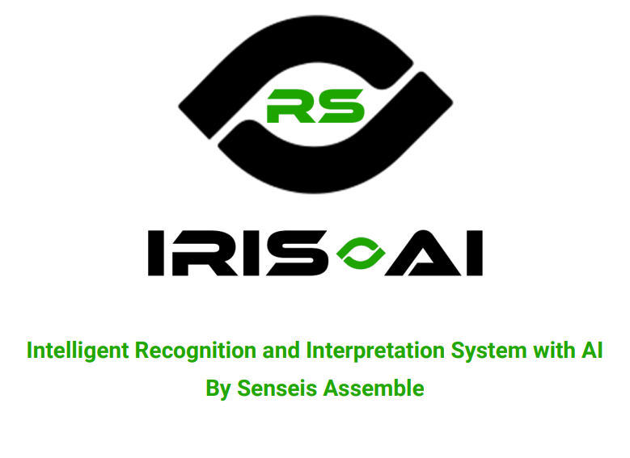

# IRIS.AI



## 📝 PROJECT DESCRIPTION
<p>IRIS.AI is an emotion and behavioral pattern recognition software, implementing the use of AI face and emotion recognition through camera or recordings in different types of hardware (glasses, Meet live sessions, etc.). The focus is in applications for psychological treatment, criminology and to help neurodivergent people.</p>

## 🔨 INSTRUCTION TO DOWNLOAD IN (software)
<ol>
  <li>Make sure Python 3.6+ is installed on your system.</li>
  <li>Install the necessary dependencies by running the following command in your terminal or CMD:</li>
  
```bash
pip install torch torchvision opencv-python pillow opencv-python transformers numpy
```
  
  <li>Ensure that your camera is connected and functioning properly if you want to use the live capture option.</li>
</ol>

## 💻 System Requirements
<ul>
  <li><strong>Operating System:</strong> Compatible with Linux (Ubuntu).</li>
  <li><strong>Python:</strong> Version 3.6 or higher.</li>
  <li><strong>Camera:</strong> Requires a connected camera to capture real-time images, or you can use a video file.</li>
</ul>

## 🚀 Program Usage
<h4>▶️ Running the Program in Real-Time:</h4>
<p>Once you've installed the necessary libraries, you can run the program to capture emotions in real-time using your camera.</p>
<ol>
  <li>Open your terminal or CMD in the directory where the Python script is located.</li>
  <li>Run the script with the following command:</li>

```bash
python camera_main.py
```
  <li>The program will start the webcam and begin detecting emotions in the people in front of it.</li>
</ol>

## 🎬 Video File
<p>If you want to analyze a pre-recorded video, you can provide the path to the video file when running the program:</p>

```bash
python video_main.py
```
(Currently, you need to input the video path inside the code itself.)

## 🖥️ Output
<p>The program will show a window with the live recording (or the pre-recorded video), and it will display the detected emotion above the person's head, with a frame around the face being captured. The possible emotions include: <strong>neutral, happiness, sadness, surprise, fear, disgust, and anger</strong>.</p>
